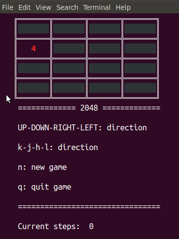
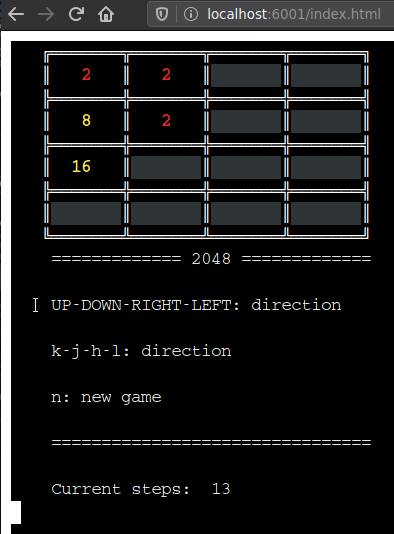

# wasm-terminal-2048
The game 2048 is written in Rust that can be played with the GUI in a command line terminal or a browser by using webassembly. Both share the same library that contains the game logic.  

## Demo 
### Command line (Left) / Browser (Right)
 

## Build & Run
### Command line 
- `cargo run -p wasm_terminal_2048_cli`

### Webassembly (web native)
- `cd wasm && ./build.sh`
- (Python 2.X) `./start-server-py2.sh` 
- (Python 3.X) `./start-server-py3.sh` 
- Open `http://localhost:6001` on browser

Note: build NodeJS package by changing the build options in `wasm-pack` in `build.sh`
[wasm-pack build options](https://rustwasm.github.io/wasm-pack/book/commands/build.html)

## Documentation
- (local build) `cargo doc --open`
- [crate.io](https://docs.rs/wasm_terminal_2048)

## Features
- Play 2048 in either command line terminal driven by the Rust crate [termion](https://docs.rs/termion/1.5.5/termion/) or browser terminal driven by the JS library [xtermjs](https://xtermjs.org/)
- The game logic is encapsulated in the library, that can be shared with different front-end

## LICENCE
MIT LICENCE

